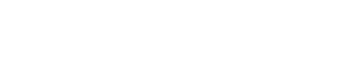

# AHOY

Welcome to my Castone Project for the Flatiron School Software Engineer Program.

Check out the live version of this project [here](http://ahoy-boats.herokuapp.com).

Browse some boats, rent a boat, post a boat!

##Local Setup

If you would like to clone this project and check it out locally:

- `rails s`: run the backend on [http://localhost:3000](http://localhost:3000)
- `npm start --prefix client`: run the frontend on
  [http://localhost:4000](http://localhost:4000)
